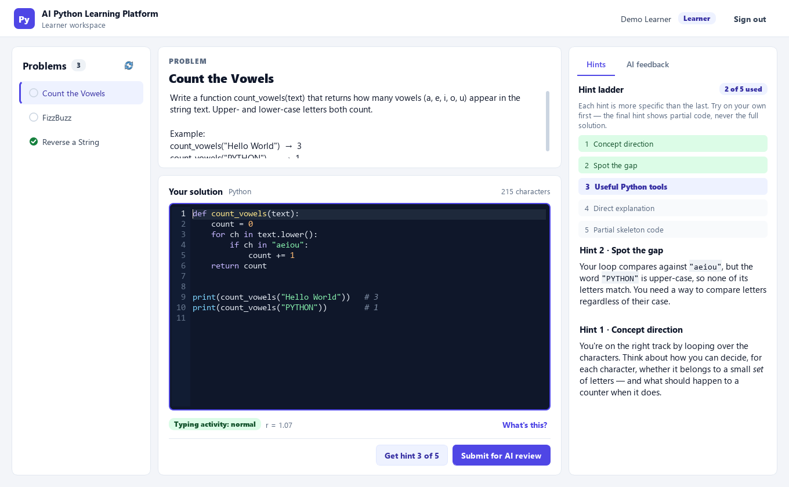
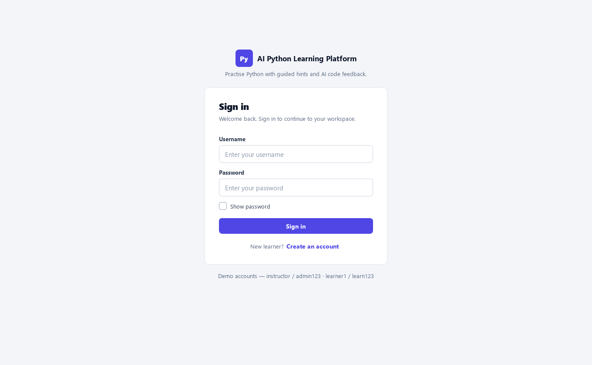
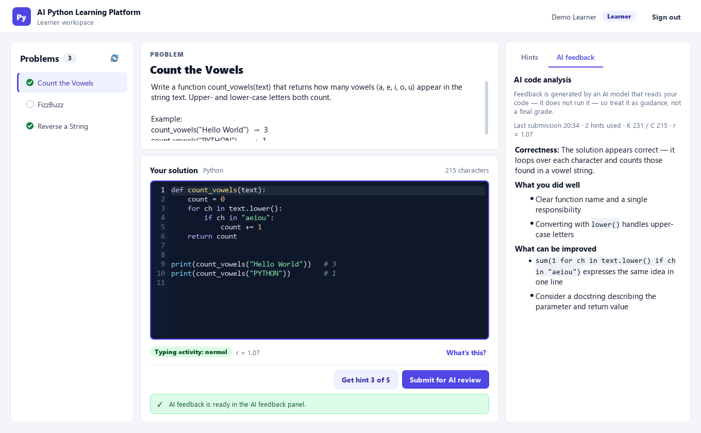
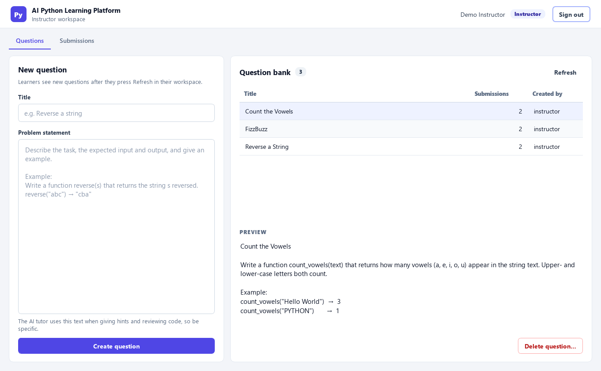
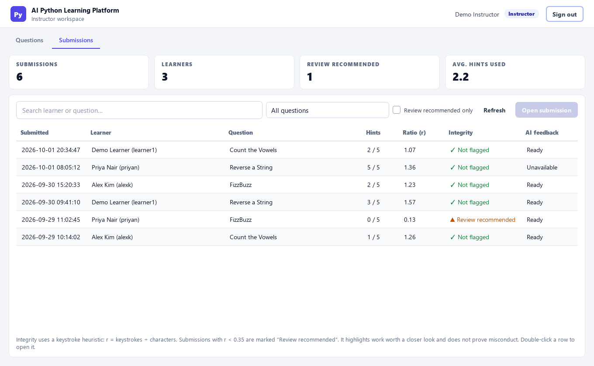
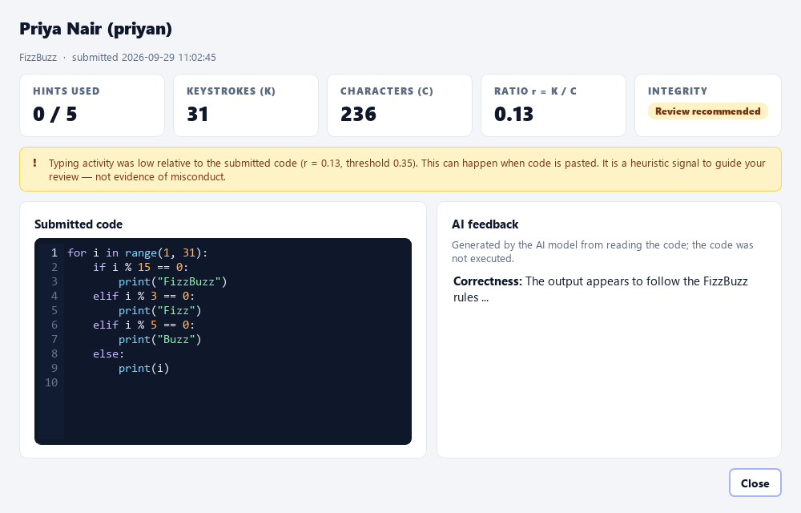

# AI Python Learning Platform

A desktop application for practising Python with an AI tutor. Learners solve instructor-set problems
in a built-in code editor, ask for **progressive hints** that get more specific step by step, and receive
**AI-generated code feedback**. Instructors manage problems and review submissions alongside a simple
**keystroke-based integrity indicator** that highlights work that may deserve a closer look.

Built with **PyQt5**, **SQLite** and **Qwen2.5-Coder-7B-Instruct** (via Hugging Face Inference Providers).



---

## Why this project

Large language models make it easy for students to get a complete answer instantly, which can skip the
problem-solving that actually builds skill. This project explores two ideas:

1. **Scaffolded help instead of answers.** Hints are rationed (5 per problem) and escalate gradually from
   conceptual direction to partial skeleton code, so a learner gets *just enough* help to keep going.
2. **Lightweight signals for instructors.** Comparing how much a learner typed with how much code they
   submitted gives a cheap, transparent heuristic that can prompt a human review. It is deliberately
   presented as a review aid — not as AI-detection and not as evidence of misconduct.

## Features

### Learner
- Problem list with per-problem submitted status
- Python code editor with line numbers, syntax highlighting and plain-text-only paste
- **Five-level hint ladder** showing which hints are used and what the next one will be
- **AI feedback** rendered as formatted text (headings, lists, code), clearly labelled as AI analysis
- Live **integrity indicator** with an in-app explanation of what it measures
- Drafts, hints and feedback are kept per problem while signed in, so switching problems loses nothing
- Clear loading, success, warning and error states; the UI never blocks while waiting for the AI

### Instructor
- Create, preview and delete problems (with a confirmation that states how many submissions are affected)
- Submissions table with summary tiles, search, per-question filter and a "review recommended" filter
- Sortable columns (time, learner, hints used, keystroke ratio, integrity, feedback status)
- Detail view with the submitted code, AI feedback, hint count and the full K / C / r breakdown

### General
- Role-based sign-in (instructor / learner) and learner self-registration
- Salted PBKDF2 password hashing (older SHA-256 hashes are upgraded automatically on login)
- Friendly error messages for missing configuration, network failures, rate limits and invalid tokens

## Screenshots

| | |
|---|---|
|  |  |
|  |  |



<sub>Screenshots use sample data. The hint and feedback text shown is illustrative.</sub>

## Technology stack

| Layer | Technology |
|---|---|
| GUI | PyQt5 (Fusion style + a single global stylesheet in `ui/theme.py`) |
| Storage | SQLite (Python standard library) |
| LLM | `Qwen/Qwen2.5-Coder-7B-Instruct` through Hugging Face Inference Providers (`huggingface_hub.InferenceClient`) |
| Keystroke capture | `pynput` |
| Tests | `unittest` (standard library) |

## Architecture

```
main.py                 Application entry point, window and screen navigation
config.py               Settings from environment variables / .env (no extra dependency)
database.py             SQLite schema, migrations and all queries
llm_client.py           Prompts for evaluation and hints; maps API failures to friendly messages
keystroke_monitor.py    pynput listener + the r = K / C integrity rule
ui/
  theme.py              Design tokens (colours, type scale) and the global stylesheet
  widgets.py            Shared components: header bar, cards, banners, badges, code editor, Markdown view
  workers.py            BackgroundTask: runs LLM calls on a worker thread, reports back via Qt signals
  login_screen.py       Sign-in
  signup_screen.py      Learner registration with inline validation
  learner_dashboard.py  Problems | editor | hints & feedback
  instructor_dashboard.py  Question bank and submission review
tests/test_core.py      Unit tests for database, hashing, integrity rule, config and error handling
docs/screenshots/       Images used in this README
```

**Threading.** LLM requests run on daemon threads (`ui/workers.py`). Results are delivered through Qt
signals so all widget updates happen on the GUI thread. Each request is tagged with the problem it belongs
to, so a hint or review that finishes after the learner switched problems is attached to the right one.
AI feedback is written to the database by the worker itself, so it is saved even if the learner signs out
before the review finishes.

**Data model.** Three tables: `users`, `questions`, `submissions`. A submission stores the code, the AI
feedback (nullable — saved first, filled in when the review completes), hints used, keystroke count (K),
character count (C) and the integrity flag.

## How the AI is used

The application calls a hosted, pre-trained model; **it does not train or fine-tune Qwen.**

- **Code evaluation.** The problem statement and submitted code are sent with a prompt asking for
  correctness, strengths, improvements and bugs. The model only *reads* the code — **submissions are not
  executed or run against test cases** — so the feedback can be wrong and is labelled as AI analysis.
- **Progressive hints.** The problem statement, the learner's current code and the hint number are sent
  with instructions for that level:

| Level | Name in the app | What the hint should contain |
|---|---|---|
| 1 | Concept direction | General direction based on what the learner seems to be attempting — no code |
| 2 | Spot the gap | What is missing or wrong in the current code, in plain English — no code |
| 3 | Useful Python tools | Relevant built-ins, methods or control structures — no code |
| 4 | Direct explanation | A more direct explanation of the fix, referencing the learner's code — no full solution |
| 5 | Partial skeleton code | A skeleton or the first few corrected lines — explicitly *not* the complete solution |

Hints that fail (e.g. network error) are not counted against the five-hint limit. Because this behaviour
depends on prompting, the model can occasionally reveal more than intended.

## Integrity indicator (keystroke heuristic)

While a problem is open, the app counts key presses made while the application window is focused.

```
r = K / C        K = keystrokes recorded for this problem
                 C = characters in the submitted code (leading/trailing whitespace stripped)

r < 0.35   →  "Review recommended"
r ≥ 0.35   →  "Not flagged"
```

Typing code by hand usually produces at least one key press per character (often more, with edits and
navigation). A much lower ratio suggests a lot of code appeared with little typing — for example, pasting.

**This is a heuristic, not a detector.** It cannot tell where code came from. Legitimate work can be flagged
(e.g. pasting your own code from another file), and copied work can pass (e.g. retyping it by hand).
The UI uses neutral wording, and the indicator is intended only to help an instructor decide what to look at.
Learners can see the indicator and an explanation of how it works.

## Getting started

### Requirements
- Python 3.9+ (developed with Python 3.12 on Windows 11)
- A Hugging Face access token for AI hints and feedback (the app still runs without one)

### Install

```bash
git clone <your-repo-url>
cd learning_platform
python -m venv .venv
# Windows: .venv\Scripts\activate    macOS/Linux: source .venv/bin/activate
pip install -r requirements.txt
```

### Configure

Copy `.env.example` to `.env` and set your token, or set it in your shell:

```bash
# Windows (PowerShell)
$env:HF_TOKEN = "hf_..."
# macOS / Linux
export HF_TOKEN=hf_...
```

| Variable | Default | Purpose |
|---|---|---|
| `HF_TOKEN` | — | Hugging Face token. Required for hints and feedback. |
| `HF_MODEL` | `Qwen/Qwen2.5-Coder-7B-Instruct:nscale` | Model id and inference provider |
| `LP_LLM_TIMEOUT` | `60` | Seconds before an AI request times out |
| `LP_DB_PATH` | `learning_platform.db` in the project folder | SQLite database location |
| `LP_SEED_DEMO_ACCOUNTS` | `1` | Create the demo accounts on first run |
| `LP_LOG_LEVEL` | `WARNING` | Logging level for developer diagnostics |

### Run

```bash
python main.py
```

The database is created automatically on first run. With demo seeding enabled, two accounts exist:

| Role | Username | Password |
|---|---|---|
| Instructor | `instructor` | `admin123` |
| Learner | `learner1` | `learn123` |

New learners can register from the sign-in screen. Instructor accounts are not created through the UI.

### Run the tests

```bash
python -m unittest discover tests
```

## Usage

**Instructor:** sign in → *Questions* tab → write a title and a specific problem statement → *Create question*.
Review work in the *Submissions* tab; double-click a row (or select it and press *Open submission*) for details.

**Learner:** sign in → pick a problem → write code in the editor → use *Get hint* when stuck →
*Submit for AI review* (or **Ctrl+Enter**). Feedback appears in the *AI feedback* tab.
**Ctrl+Shift+H** requests the next hint.

## Known limitations

- **No code execution.** Feedback comes from an LLM reading the code; there are no test cases or sandbox.
- **Heuristic integrity signal** — see the section above. It counts all keys (including arrows and
  shortcuts) while the window is focused, and learners can see it, so it can be influenced deliberately.
- **Session-only learner state.** Drafts and the per-problem hint count live in memory while signed in;
  signing out (or restarting) resets them. The hint count used is stored with each submission.
- **Single machine.** SQLite is local; instructors and learners share one database file on one computer.
- **Accounts.** No password reset or change. Demo accounts have publicly known passwords — set
  `LP_SEED_DEMO_ACCOUNTS=0` before first run for any real use, and remove them from existing databases.
- **Platform notes.** `pynput` installs a system keyboard hook: macOS requires Accessibility permission and
  it does not work under Wayland on Linux. Developed and tested on Windows.
- **Privacy.** Problem statements and learner code are sent to Hugging Face and the selected inference
  provider. Do not submit personal or sensitive data.
- **Not production-hardened.** Intended for coursework, demos and research prototypes.

## Future work (proposed, not implemented)

- Sandboxed execution of submissions against instructor-defined test cases
- Persisting drafts and hint usage across sessions
- Learner submission history and instructor per-learner views
- Editor-level paste detection to complement the keystroke ratio
- Configurable hint limits and integrity threshold per question
- CSV export of submissions
- Networked deployment with a shared database server

## Research context

The project was developed in an academic research context exploring AI-assisted programming education.
During development, the keystroke heuristic (τ = 0.35) was tried in a small, informal evaluation of about
20 submissions. That evaluation was not a controlled study, and it does not establish how well the
heuristic performs for other learners, tasks or settings.

## License

No license has been chosen yet. Until one is added, all rights are reserved by the author.
